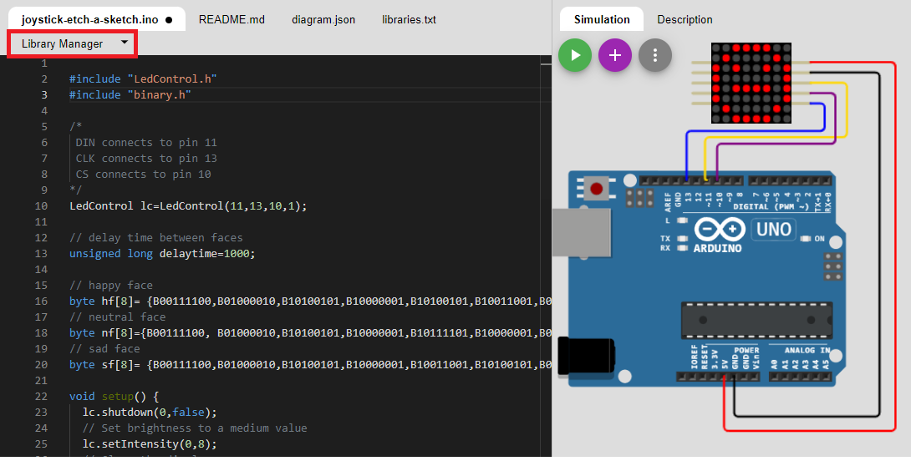
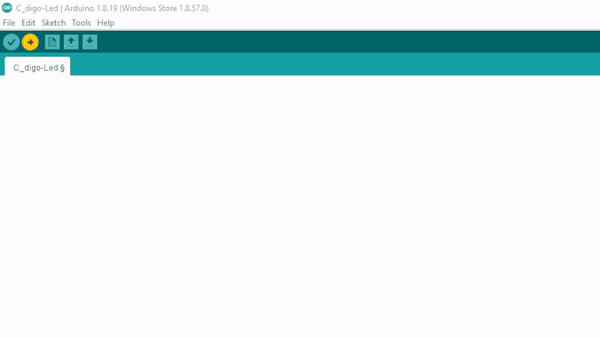
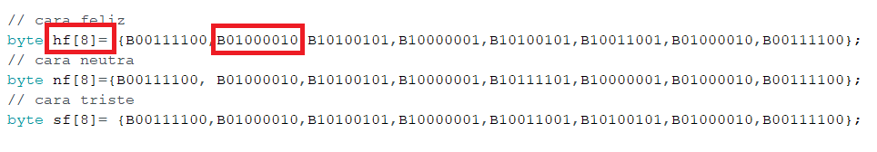
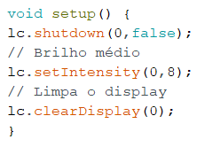
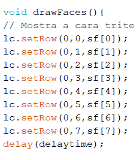
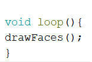

<h2 align='center'>
  Testando a plataforma Wokwi 
</h2>
<h3>
  Visão geral 
</h3>

  
Wokwi é um simulador de Eletrônica online. Você pode usá-lo para simular Arduino, ESP32 e muitas outras placas, peças e sensores populares. Iremos fazer uma carinha feliz na matrix de led 8x8 no Wokwi e depois testar na prática para ver se funciona.

Visite esse <a href="https://embarcados.com.br/wokwi-simulador-de-esp32/#O-que-e-o-Wokwi
">artigo</a> se voçê quiser saber mais sobre a plataforma.

Voce ira aprender:
<ul>
    <li>Instalar uma biblioteca no Wokwi</li>  
</ul>

  <h2 align='center'>Começando...</h2>
      <h3>Componentes utilizados</h3>
      <ul>
    <li>8x8 LED Dot Matrix with MAX7219 Controller

</li> 
    <li>Arduino Uno.

</li> 
</ul>
      
Clique <a href="https://wokwi.com/projects/354667603761960961">nesse link</a> e você será redirecionado ao projeto no Wokwi. Onde já esta os componentes e sua respectivas conexões.

    <h3>Conexões</h3>
      
As conexões do outro lado do módulo do Led não serão feitas, pois nosso objetivo é usar apenas uma matriz de 8x8.

      <table border="3" align='center'>
    <tr>
        <td><b>Pinos Led</b></td>
        <td><b>Pinos Arduino</b></td>
    </tr>
    <tr>
        <td align='center'>VCC</td>
        <td align='center'>5V</td>
    </tr>
    <tr>
        <td align='center'>GND</td>
        <td align='center'>GND</td>
    </tr>
    <tr>
        <td align='center'>DIN</td>
        <td align='center'>Pin 12</td>
    </tr>
    <tr>
        <td align='center'>CS</td>
        <td align='center'>pin 10</td>
    </tr>
    <tr>
        <td align='center'>CLK</td>
        <td align='center'>pin 11</td>
    </tr>
</table>
<h3>Emoji</h3>

 Logo abaixo tem o código que mostra um Emoji sorrindo, mas antes de executarmos esse código temos que instalar a biblioteca <code>LedControl.h</code> para o código funcionar. Para fazer isso é muito facil, basta você clicar em <code>Library Manager</code> e pesquisar por <code>LedControl</code>.

<h3 align='center'>Código</h3>

 Agora execute o código:

<pre><code >

#include "LedControl.h"
#include "binary.h"

/*
 DIN conectado no pino 12
 CLK conectado no pino 11
 CS conectado no pino 10 
*/
LedControl lc=LedControl(12,11,10,1);

// Tempo de delay entre as caras
unsigned long delaytime=1000;

// cara feliz
byte hf[8]= {B00111100,B01000010,B10100101,B10000001,B10100101,B10011001,B01000010,B00111100};
// cara neutra
byte nf[8]={B00111100, B01000010,B10100101,B10000001,B10111101,B10000001,B01000010,B00111100};
// cara triste
byte sf[8]= {B00111100,B01000010,B10100101,B10000001,B10011001,B10100101,B01000010,B00111100};

void setup() {
  lc.shutdown(0,false);
  // Brilho médio
  lc.setIntensity(0,8);
  // Limpa o display
  lc.clearDisplay(0);  
}

void drawFaces(){
  // Mostra a cara trite
  lc.setRow(0,0,sf[0]);
  lc.setRow(0,1,sf[1]);
  lc.setRow(0,2,sf[2]);
  lc.setRow(0,3,sf[3]);
  lc.setRow(0,4,sf[4]);
  lc.setRow(0,5,sf[5]);
  lc.setRow(0,6,sf[6]);
  lc.setRow(0,7,sf[7]);
  delay(delaytime);
  
  // Mostra a cara neutra
  lc.setRow(0,0,nf[0]);
  lc.setRow(0,1,nf[1]);
  lc.setRow(0,2,nf[2]);
  lc.setRow(0,3,nf[3]);
  lc.setRow(0,4,nf[4]);
  lc.setRow(0,5,nf[5]);
  lc.setRow(0,6,nf[6]);
  lc.setRow(0,7,nf[7]);
  delay(delaytime);
  
  // Mostra a cara feliz
  lc.setRow(0,0,hf[0]);
  lc.setRow(0,1,hf[1]);
  lc.setRow(0,2,hf[2]);
  lc.setRow(0,3,hf[3]);
  lc.setRow(0,4,hf[4]);
  lc.setRow(0,5,hf[5]);
  lc.setRow(0,6,hf[6]);
  lc.setRow(0,7,hf[7]);
  delay(delaytime);
}

void loop(){
  drawFaces();
}</code></pre>

Espere o seguinte resultado:

<h3 align='center'>
  Testando na prática
</h3>

  
Agora vamos testar na prática o que fizemos no simulador, iremos precisar dos mesmos componentes, serão as mesmas conexões e utilizaremos o Arduino IDE.

1. Monte seu circuito na prática fazendo as mesmas conexões

2. Copie e cole o código para o Arduino IDE.

3. Selecione a porta <code>COM</code>

4. Execute o código.

 Espere o seguinte resultado:

<h3 align='center'>
  Explicando o código
</h3>
<h4 align='center'>Usando as funções da biblioteca LedControl</h4>

A maneira mais fácil de exibir algo na matriz de pontos é usando as funções <code>setLed()</code> , <code>setRow()</code> ou <code>setColumn()</code> . Estas funções permitem controlar um único led, uma linha ou uma coluna de cada vez.

Aqui estão os parâmetros para cada função:

<b>setLed(addr, linha, coluna, estado)</b>
<ul>
    <li><code>addr</code> é o endereço da sua matriz, por exemplo, se você tiver apenas 1 matriz, o int addr será zero.</li>  
    <li><code>linha</code> é a linha onde o led está localizado.</li>  
<li><code>col</code> é a coluna onde o led está localizado</li>  
<li><code>Estado</code> <ul><li>É verdadeiro ou 1 se quiser acender o led</li><li>É falso ou 0 se você quiser desligá-lo</li></ul></li> 
</ul>
<b>setRow(addr, linha, valor)</b>

<b>setCol(addr, coluna, valor)</b>

<h4 align='center'>byte arrays</h4>

 Essas Arrays de Bytes são o que informa... os pontos gráficos que serão acionados no Display 

<code>lc.shutdown(0,false);</code> Liga o Display.

<code>lc.setIntensity(0,8);</code> Configura o brilho do Display, sendo o máximo 15 e o mínimo 0.

<code>lc.clearDisplay(0);</code> Limpa o display após liga-lo.

<code>void drawFaces(){</code> é uma função void onde mostra a cara triste, neutra e feliz.

<code>lc.setRow(0,0,sf[0]);</code> A função setRow(addr,row,value) recebe 3 argumentos. O primeiro é o endereço do dispositivo. O segundo é a linha que precisa ser atualizada e o terceiro é o valor a ser definido para esta linha.

<code>delay(delaytime);</code> Tempo de delay, nesse caso 1 segundo entre as faces, foi atribuido á uma variável global mas poderia ser o valor numérico em milissegundos normal.

<code>void loop(){</code> Executa o código em loop.

<code>drawFaces();</code> Executa o código que está na função que acabamos de criar <code>void drawFaces(){</code>.
